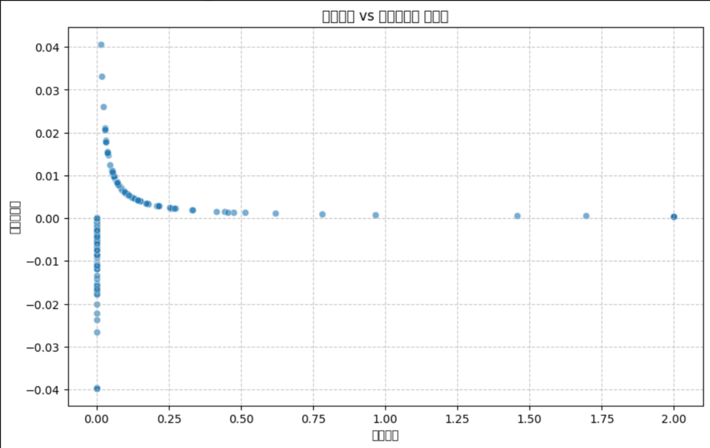

# Kaggle比赛： Hull Tactical - Market Prediction —— 使用XGBoost市场预测

## 项目概述
使用XGBoost模型对市场数据进行预测，生成投资决策建议。

## 如何决定投资比例？

根据score函数的定义，当策略波动率大于指数波动率的1.2倍以及策略收益小于指数收益的时候，会施加分数的惩罚。

当我们获取前180天的预测收益，以最大化score函数为目标后，我们得到了下面的图像。横坐标是持仓比例、纵坐标是当日收益率。

从图中我们可以看到，需要拟合一个类似反函数的曲线，并且当收益率为零时，持仓比率为0。

单个模型直接预测当日收益率的准确性较低，我们结合了多个模型的预测结果，来强化模型的准确性，提高其泛化能力。

最终的持仓比例函数为：

$$
w = \begin{cases}
0, & r_{\text{pred}} \le 0 \text{ 且 } p_{\text{up}} \le 0.5 \\
0.08, & r_{\text{pred}} < 0 \text{ 且 } p_{\text{up}} > 0.5 \\
\displaystyle
\alpha \cdot p_{\text{up}} \cdot \frac{\ln\left(1 + \dfrac{\beta}{r_{\text{pred}}}\right)}{\sigma}, & r_{\text{pred}} > 0
\end{cases}
$$

其中  
- $r_{\text{pred}}$：模型对当日收益率的预测值  
- $p_{\text{up}}$：模型预测“上涨”方向的概率（0–1）  
- $\sigma$：对应资产的预测波动率，用于风险调整  
- $\alpha$：全局杠杆系数，控制整体仓位上限
- $\beta$：灵敏度参数，决定曲线在收益率接近零时的陡峭程度

实现了三种情况的仓位控制：
1. 当预测收益率为负且上涨概率较低时，完全不持仓
2. 当预测收益率为负但上涨概率较高时，持仓0.08作为保守策略
3. 当预测收益率为正时，根据收益率、上涨概率和波动率计算最优持仓比例

通过联合调节 $\alpha$ 与 $\beta$，可在“收益–风险”权衡中实现更精细的仓位控制。

## 核心文件
- `main.py`: 主程序，包含数据加载、特征工程、模型训练和评估
- `XGBoost_predict_submission.py`: 生成最终预测结果文件（正式提交）
- `stacking.py`: 模型融合策略脚本
- `script.ipynb`: 实验脚本

## 项目思路
1. 加载训练数据，进行预处理和缺失值处理
2. 构建滞后特征和技术指标作为模型输入
3. 使用XGBoost训练多个子模型（收益率、波动率、方向）
4. 结合预测结果计算最优投资比例
5. 生成符合要求的提交文件

## 使用方法
1. 运行`main.py`进行模型训练和验证
2. 执行`XGBoost_predict_submission.py`生成预测结果
3. 通过`script.ipynb`查看可视化分析

## 依赖
- Python 3.x
- XGBoost
- Pandas, NumPy
- Scikit-learn